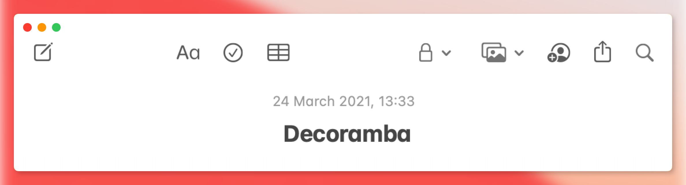
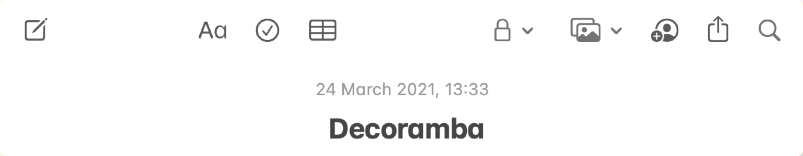

# Decoramba

Decorate your screenshots for personal blog, Twitter or any other social media

### Features:
1. Stretch screenshot to make it more airy
2. Add top navigation decoration
3. Configure background
    1. Change paddding
    2. Apply background color, gradient or image
    3. Blur background to make content more “vibrant”

Original undecorated image for example:

### Available in:
1. Build from source: here on GitHub 😊
2. Mac app: download from [releases](https://github.com/Nekitosss/decoramba/releases/latest)
3. AppStore (iOS & Mac): Coming soon...

Inspired by beautiful [Carbon code decorator](https://github.com/carbon-app/carbon)
